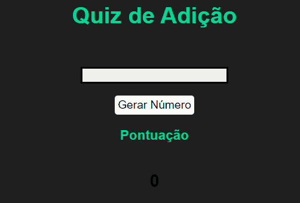

<h1 align="center">🧠 Quiz de Adição ➕</h1>

## 📕Sobre

**Quiz de Adição** é um quiz que eu criei para praticar meus conhecimentos com DOM, será gerado dois números e o seu objetivo é acertar o resultado da soma, conforme você aumenta sua pontuação também aumenta a dificuldade (gerando números maiores).

**Obs:** É possível fazer com outros operadores (adição, subtração, divisão e multiplicação), só é preciso mudar no arquivo do JavaScript

## 🛠️Tecnologias
- HTML
- CSS
- JavaScript
  
## 👨‍🏫Demonstração
<h1 align=center>
    
</h1>
